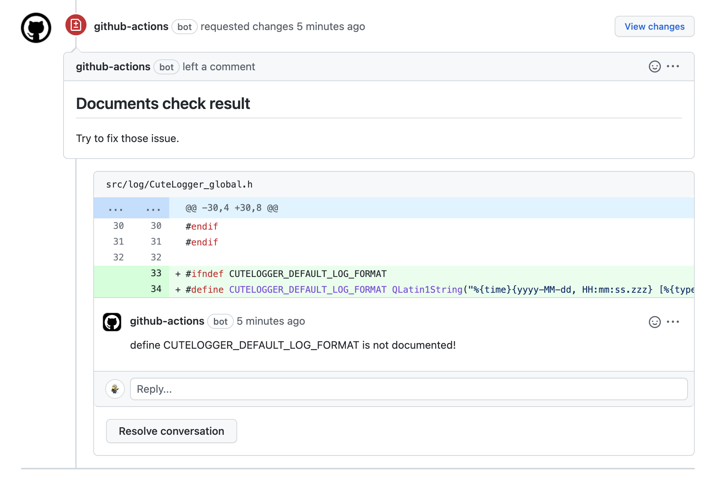

# action-doxygencheck

use doxygen and coverxygen to check doc coverage.

doxygen to generate xml document resource, and use coverxygen to get document coverage.

then this project to get pull request diff and coverage data to get pull request document coverage.

this can actor as github-action\[bot\], personal or github app (custom bot).

## Usage:
```
- use: tsic404/action-doxygencheck@master
    with:
      # get need check pull request number
      pull_request_id:
      # after allow approve or not
      allow_approve:
      # coverxygen check kind, support enum,enumvalue,friend,typedef,variable,function,signal,slot,class,struct,union,define,file,namespace,page,all
      check_kind:
      # install build depends,because some doc make in cmake commane.
      install_depends:
      # install coverxygen or not
      install_coverxygen:
      # install doxygen or not
      install_doxygen:
      # checked actor
      check_actor_as:
      # the command to generate document,generate coverxygen data in json format.
      gen_doc_command:

```
## actor: 

+ GH(default) use github token, need set GITHUB_TOKEN.
+ PAT, personal access token, need personal token in secrets as PERSONAL_ACCESS_TOKEN
+ APP, which used as github app (custom bot), need APP_ID and APP_PRIVATE_KEY

## example:
### screenshot


### config:
```
name: doxygen-check
on:
  pull_request_target:
    paths-ignore:
      - ".github/workflows/**"

concurrency:
  group: ${{ github.workflow }}-pull/${{ github.event.number }}
  cancel-in-progress: true

jobs:
  DOXYGEN_CHECK:
    container:
      image: debian:9
      options: --privileged
      volumes:
        - /sys/fs/cgroup:/sys/fs/cgroup
        - /etc/machine-id:/etc/machine-id

    runs-on: ubuntu-latest
    env:
      APP_ID: 215996
      APP_PRIVATE_KEY: ${{ secrets.APP_PRIVATE_KEY }}
      GITHUB_TOKEN: ${{ secrets.GITHUB_TOKEN }}

    steps:
      - name: init base environment
        run: |
          echo 'debconf debconf/frontend select Noninteractive' | debconf-set-selections
          apt-get update && apt-get install -y --force-yes ca-certificates apt-transport-https sudo
          echo 'deb [trusted=yes] http://community-packages.deepin.com/deepin/ apricot main contrib non-free \ndeb-src [trusted=yes] http://community-packages.deepin.com/deepin/ apricot main contrib non-free' > /etc/apt/sources.list
          apt-get update && apt-get dist-upgrade -y --force-yes
          apt-get install  -y --force-yes cmake
      
      - uses: actions/checkout@v3
        with:
          ref: ${{ github.event.pull_request.head.sha }}
          persist-credentials: false

      - uses: tsic404/action-doxygencheck@master
        with:
          pull_request_id: ${{ github.event.pull_request.number }}
          allow_approve: false
          install_depends: true
          gen_doc_command: |
            cmake -Bbuild -DDOXYGEN_GENERATE_XML=1 .
            cmake --build build --target doxygen
            python3 -m coverxygen --xml-dir=./build/docs/xml --src-dir . --format json --kind $CHECK_KIND --output $CHECK_RES


```
